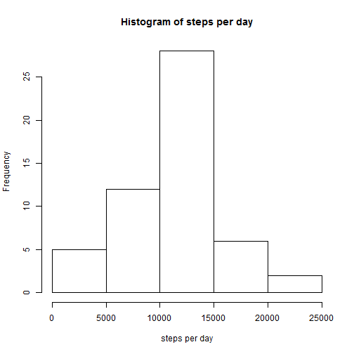
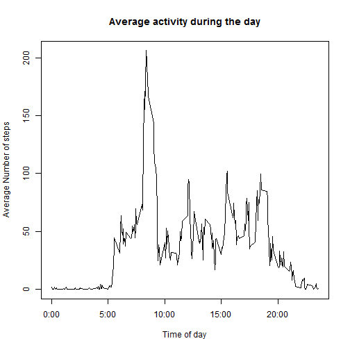
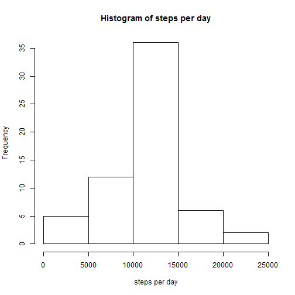
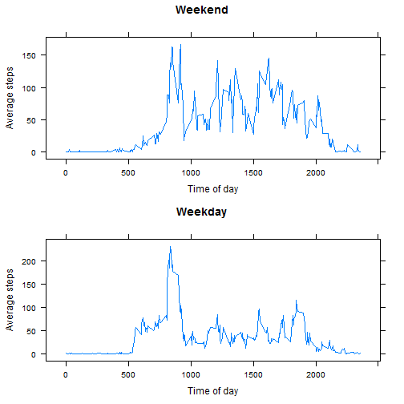

This document will cover the steps needed for hw1 in the Reproducible Research Course. The data for this assignment is available here "https://d396qusza40orc.cloudfront.net/repdata%2Fdata%2Factivity.zip" The data has been downloaded to a file and unzipped.


## Loading and Pre-processing data

```r
require(plyr)
data <- read.csv("activity.csv") 
dataByDay <- ddply(data, "date", summarize, steps = sum(steps))
dataByInterval <- ddply(data, "interval", summarize, averagesteps = mean(steps, na.rm = T))
```

## Mean total number of steps taken per day
The below plot is a histogram of the total number of steps taken each day

```r
hist((dataByDay$steps), xlab="steps per day", main="Histogram of steps per day")
```

 

The mean steps taken per day are:


```r
mean(dataByDay$steps, na.rm = T)
```

```
## [1] 10766
```

The median steps taken per day are:


```r
median(dataByDay$steps, na.rm = T)
```

```
## [1] 10765
```

## Average daily activity pattern

The below graph shows the average number of steps taken acros all the time intervals in the day


```r
plot(dataByInterval$interval, dataByInterval$averagesteps, type="l", xaxt = "n", xlab="Time of day", ylab="Average Number of steps", main="Average activity during the day")
axis(1, labels = c('0:00', '5:00', '10:00', '15:00', '20:00'), at = c(0, 500, 1000, 1500, 2000))
```

 

Time interval during the day which contains the maximum number of steps during the day:


```r
dataByInterval[dataByInterval$averagesteps == max(dataByInterval$averagesteps, na.rm = T),]
```

```
##     interval averagesteps
## 104      835        206.2
```

## Imputing missing values

Total number of rows with missing values in the data set:


```r
nrow(data[!complete.cases(data),])
```

```
## [1] 2304
```

The missing values will be filled in by taking the average of that time interval for which the value is missing.


```r
dataWithNoNAs <- ddply(data, "interval", function(df) {i <- df$interval[1]; df$steps[is.na(df$steps)] <- dataByInterval[dataByInterval$interval == i,]$averagesteps; return (df)})
dataWithNoNAsByDay <- ddply(dataWithNoNAs, "date", summarize, steps = sum(steps))
```

The below is a histogram of the total number of steps taken per day

```r
hist((dataWithNoNAsByDay$steps), xlab="steps per day", main="Histogram of steps per day")
```

 

The mean steps taken per day are:


```r
mean(dataWithNoNAsByDay$steps, na.rm = T)
```

```
## [1] 10766
```

The median steps taken per day are:


```r
median(dataWithNoNAsByDay$steps, na.rm = T)
```

```
## [1] 10766
```

Since the data that was imputed was an average of the values present there is no net effect on the mean and median values as they were dropped the first time around and now they just contain the average.

## Differences in activity patterns between weekdays and weekends

Adding a factor variable to mark whether a day is a weekend or a weekday


```r
dayType <- factor(ifelse(weekdays(as.Date(dataWithNoNAs$date, format = "%Y-%m-%d")) %in% c("Saturday", "Sunday"), "Weekend", "Weekday"))
dataWithNoNAs <- cbind(dataWithNoNAs, dayType)
```

The below time series plot shows how the activity changed based of if it were a weekday or weekend

```r
dataSplit <- split(dataWithNoNAs, dataWithNoNAs$dayType)
WeekendDataByInterval <- ddply(dataSplit$Weekend, "interval", summarize, averagesteps = mean(steps, na.rm = T))
WeekdayDataByInterval <- ddply(dataSplit$Weekday, "interval", summarize, averagesteps = mean(steps, na.rm = T))

require(gridExtra)
require(lattice)
p1<- xyplot(WeekendDataByInterval$averagesteps ~ WeekendDataByInterval$interval, type="l", xlab = "Time of day", ylab = "Average steps", xaxt="n", main = "Weekend")
p2 <- xyplot(WeekdayDataByInterval$averagesteps ~ WeekdayDataByInterval$interval, type="l", xlab = "Time of day", ylab = "Average steps", xaxt="n", main = "Weekday")
grid.arrange(p1, p2, nrow=2)
```

 
